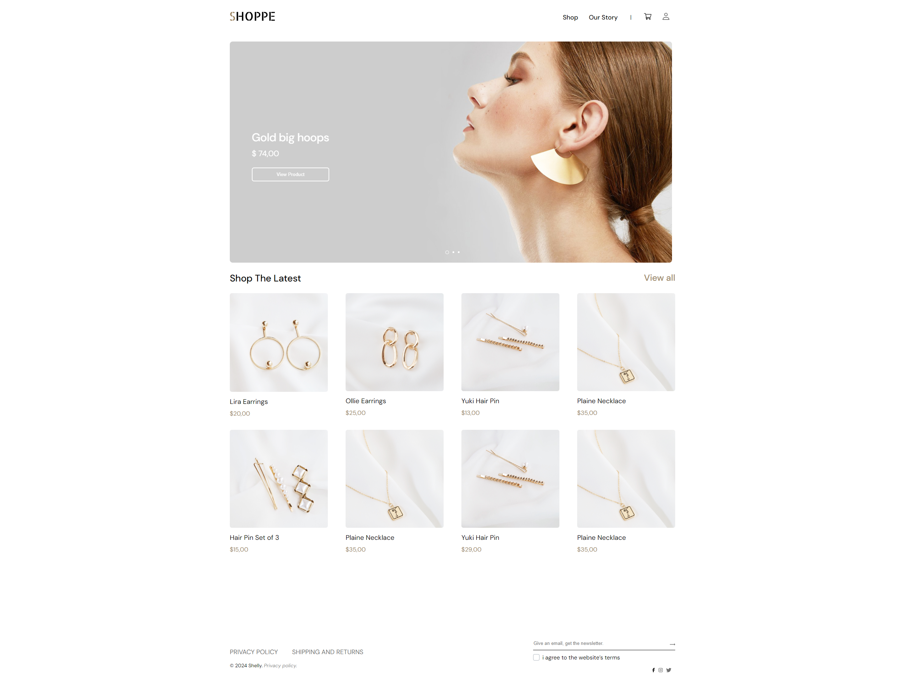

## Description

Проект выполнен по архитектуре SPA.

*SHOPPE* - интернет-магазин ювелирных украшений, где пользователь может выбрать товар, добавить его в корзину, совершить заказ и зарегистрировать свой персональный аккаунт.

## Functional
- Получение данных из БД PostgreSQL;
- Отрисовка продуктов;
- Быстрый просмотр продукта в модальном окне;
- Карточка товара;
- Аккаунт клиента(авторизация, регистрация);
- Хранение корзины в LocalStorage для неавторизованных пользователей и синхронизация при авторизации;
- Карусель изображений на главной стринице;
- Индикатор загрузки при длительном ожидании;
- Валидация формы;
- Адаптивный интерфейс для разных устройств;
- Обработка ошибок.

## Stack
- HTML5;
- CSS3:
  - Flexbox;
  - Adaptive UI;
  - Media Queries;
  - CSS modules;
- Вёрстка по макету в Figma;
- JavaScript:
  - Promise;
  - VanillaJS + jQuery;
  - Rest API;
- React:
  - React Hooks;
  - React Router;
  - React Select;
  - Webpack.

## Screen

